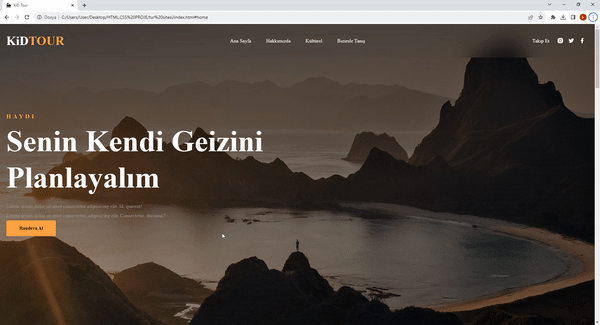

<h1>Tour-Site</h1>

In the project, I designed the website of a tour company.I included the tours and their images on the website. I determined the company's communication areas with icons. I designed a button to contact you via e-mail address. I added campaigns and make an appointment sections.

<h2> Technologies I Use </h2>

I designed my project with HTML5 and CSS3 codes.

<h2>Screenshot</h2>

